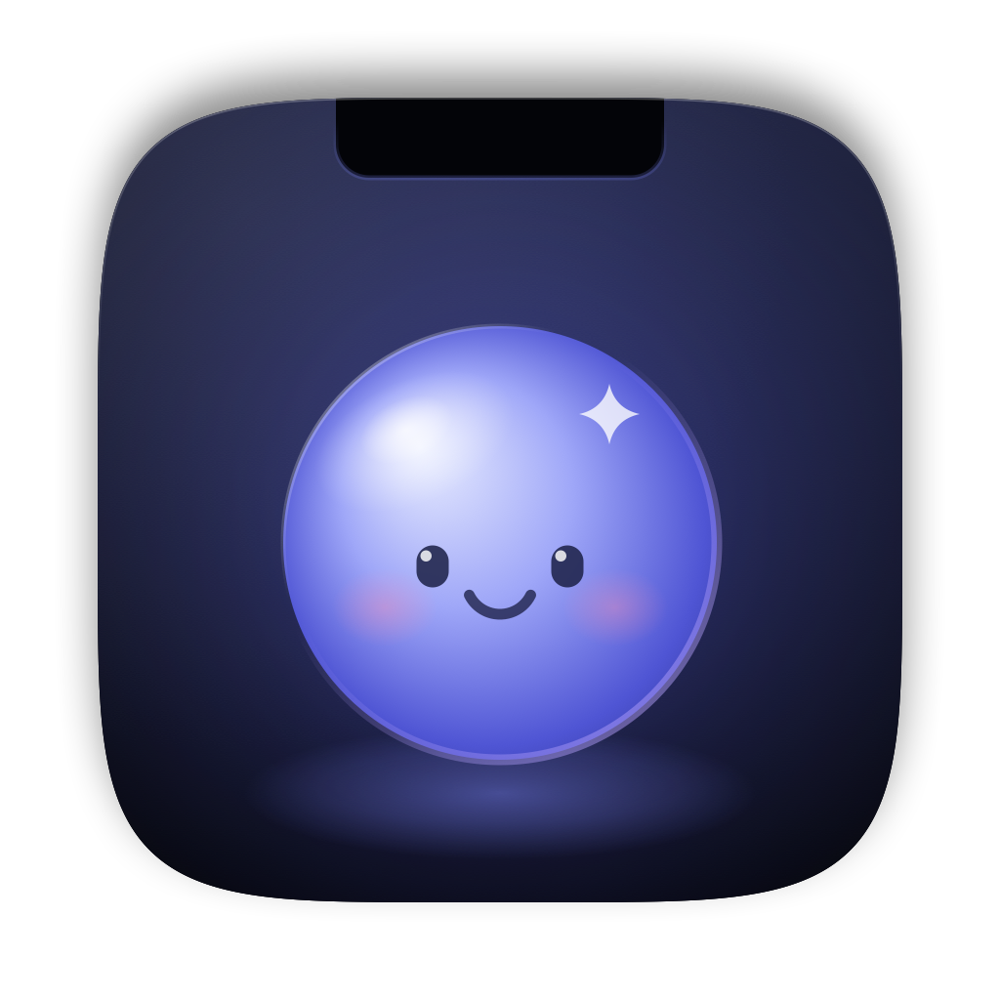
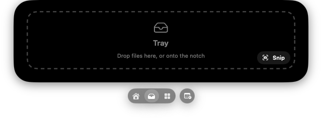
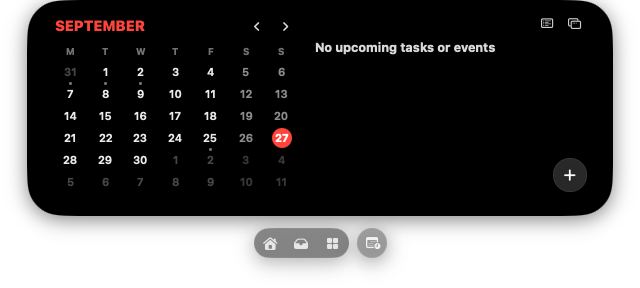
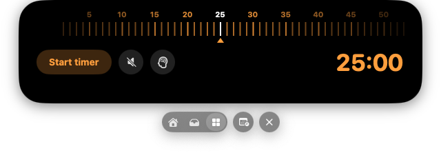
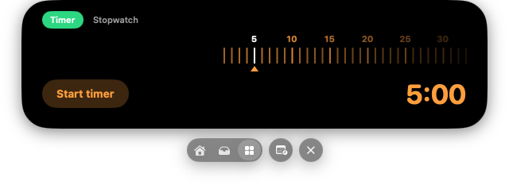
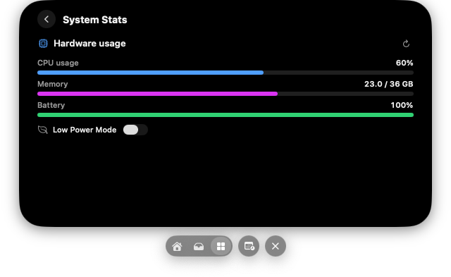
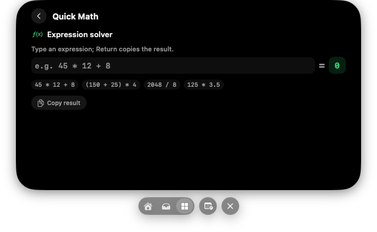

<p align="center"></p>

# Tama for Mac ✨

> **Supercharged Dynamic Island for macOS** — Native Swift & SwiftUI implementation inspired by [getdroppy.app](https://getdroppy.app).


[](https://buymeacoffee.com/ntb1nh)

Tama turns the hardware notch (or a floating Dynamic Island pill on notchless Macs) into a **shelf**: at rest the notch only grows two small wings — album art and a music wave — and when opened it unfolds into one page at a time (Player, Tray, Widgets, Calendar), switched by a floating lane pill underneath. The clipboard lives in its own shelf docked to the bottom of the screen.

---

## 📸 Screenshots

<p align="center">
  
  <br><sub><b>Tray</b> — drop files on the notch to hold them; the lane pill below switches pages</sub>
</p>

<p align="center">
  
  <br><sub><b>Calendar</b> — month grid, agenda and reminders from your calendars</sub>
</p>

| Pomodoro | Timer |
| :---: | :---: |
|  |  |
| **System Stats** | **Quick Math** |
|  |  |

---

## 🌟 Key Features

### 1. Dynamic Island & Notch Integration
- **Resting notch**: Hugs the physical notch exactly. While music plays it grows two wings — album art on the left, the periwinkle music wave on the right (click the wave to play/pause). Tray count, a running Pomodoro or High Alert use the wings when nothing plays.
- **Floating Island Pill**: On notchless Macs and external displays the same content sits in a floating pill.
- **The shelf**: Click (or hover) the notch and it morphs into a black shelf with big soft bottom corners. One page at a time: **Player**, **Tray**, **Widgets**, **Calendar**.
- **Lane pill**: A floating capsule under the open shelf switches pages — house, tray (with a live file count) and widgets, plus a round calendar button. `⌘1 – ⌘4` do the same.
- **Quick actions on drag**: Drag files onto the notch and it unfolds into four tiles — **Keep**, **Share Link**, **AirDrop**, **Convert**. The tile under the pointer takes the drop.
- **Live Activities**: The resting wings also carry what's happening now — a countdown for the next meeting (with a **Join** button for Zoom, Meet, Teams and Webex links when it starts), charger plugged in / low battery / fully charged, AirPods or another wireless output connecting, a running Timer, and browser downloads in progress (opt-in; offers to add the finished file to the Tray). Urgent ones briefly take over from music; each can be turned off in Settings › Dynamic Island.
- **Volume HUD**: Two-finger scroll on the resting notch changes the system volume; the level spreads into the notch wings.
- **Volume & brightness HUDs**: The volume and brightness keys — and volume changes from anywhere, like Control Center — show their level in the notch wings, with a meter in white, your accent, or *Decibel* (green → red with a glow, the empty track tinted to match). With **Hide the macOS volume / brightness HUD** (needs Accessibility — *Device Control and Data Access* on macOS 27), Tama handles those keys itself — same 1/16 steps, ⌥⇧ for finer ones, the system feedback sound — so only the notch shows it; HDMI and other fixed-volume outputs, and displays Tama can't dim, keep the macOS HUD. Settings › **Sound** and › **Display** each set their own duration, meter style, percentage, label and animation speed (Smooth / Fast / Instant); Sound can lead with the output device (AirPods…) instead of the speaker. In All Displays the level shows only on the screen in use; in the open shelf it shows along the bottom. Scroll on the notch for volume, ⌥-scroll for brightness (each can be turned off).
- **VPN status**: A connected VPN shows a lock and its session time in the notch, with a banner when it connects or drops.
- **Low Power Mode**: The low-battery banner offers a one-tap **Low Power** button (asks for your admin password); System Stats has a switch too.
- **Background jobs**: Conversions keep running when the shelf closes; a progress ring in the notch follows them, and Quick Convert / the Tray convert bar can cancel them (partial files are removed).
- **Fluid Morph Springs**: The shape, its size and its content ride one spring (`DS.Motion.morphOpen` / `morphClose`).

### 2. Tray & Floating Basket
- **Drag-and-Drop Tray**: Drop screenshots, PDFs, images, archives, or code files onto the island to hold them temporarily.
- **Tray page**: A dashed "Tray" drop zone while empty, then a rail of 56 pt file tiles with names underneath. Click to select, double-click to open, hover for the delete badge, drag out anywhere; share / convert / zip / clear from the round corner buttons.
- **Grab, jiggle, drop**: Shake a file drag anywhere on screen and the floating Basket flies in to hold it.
- **Tactile Auditory & Haptic Layers**: Distinct, satisfying native macOS sounds and trackpad haptics for file drops, picks, deletion, and snips.
- **Quick Snip to Tray**: Capture any screen region or window straight into the Tray with one click (`⌃⌥S`).
- **On-Device Vision OCR & Quick Convert**: Right-click any tray image to extract text with Apple Vision OCR. Right-click any file to convert it: images → PNG / JPEG / HEIC / GIF / TIFF / PDF (WebP too when Homebrew's `cwebp` is installed — macOS has no WebP encoder), PDFs → PNG / JPEG per page or TXT, video → MP4 / MOV / GIF / M4A, documents (RTF, DOC/DOCX, HTML, TXT) → PDF / TXT / RTF / HTML / DOCX.
- **Batch Multi-Select**: Select multiple tray items to archive into `.zip`, AirDrop, or bulk delete.
- **Quick Previews**: See file extension badges, human-readable file sizes, and thumbnail icons.
- **Drag Out Anywhere**: Drag held files out of Tama directly into Finder, Slack, Discord, Mail, Figma, or any application.
- **Floating Basket**: Detachable tray that hovers over every space for multi-window file gathering, collapsing to a pill that still accepts drops. "Drag all" carries every file at once.
- **Keyboard first**: the Tray and the Basket answer the same keys — arrows to move (⇧ extends the selection), ⌘A select all, Space for Quick Look, Return to open, ⌘C to copy, ⌫ to remove (⌘Z undoes it from the banner), ⇧⌘M to move the files somewhere. In a Basket, ⌘↑ sends the selection to the Shelf, ⌘M minimises it to its pill and ⌘W puts it away. A Basket takes the keyboard when you click it and hands it straight back when you click another app.
- **Remembered**: Tray files (snips, conversions and archives are kept in `~/Library/Application Support/Tama/Tray` so they survive a restart), clips, pinboards, favourites, card names, the scratchpad and droplet switches survive a relaunch. Tray capacity and auto-remove-on-drag-out are in Settings.
- **Share Link**: AirDrop the held files to a nearby device, or share them on your local network: Tama serves them from a small built-in web server behind a random-token link and QR code, so a phone on the same Wi-Fi can download them. The link stops after 15 min, 1 hour or when Tama quits. Clears of the Tray and clipboard history can be undone from the banner.

### 3. Clipboard Manager
- **Docked clipboard shelf**: `⌃⌥C` slides a black shelf up from the bottom of the screen with a horizontal row of clip cards — text, links, code, colour swatches, image thumbnails and copied Finder files (icon and name), each with a title chip showing the source app.
- **Images & files**: Screenshots (`⌃⇧⌘4`) and copied images are stored as PNGs (downscaled to 2048 px, identical repeats skipped); files copied in Finder are kept as file references. Copy or Return-to-paste puts the real image or files back on the pasteboard, so pasting into Finder or an editor works.
- **Search inside images**: Every image clip is read with on-device Apple Vision OCR (Vietnamese and English where available), so ⌘F finds screenshots by the words in them; right-click › Copy Text copies what was recognised.
- **Pinboards**: Tabs for *Clipboard* plus your own pinboards (coloured dots); add one with **+**, drag a card onto a tab to file it. Pinboard clips survive "Clear History".
- **Favourites, rename, transforms**: Star a card to keep it up front (yellow chip), double-click its chip to rename, right-click for Copy As (UPPERCASE, lowercase, RGB, SwiftUI Color, NSColor…).
- **Keyboard first**: ← → to move, Return to paste into the app underneath, ⌘C to copy, Delete to remove, ⌘F to search, Esc to close.
- **Privacy controls**: Pause recording for 5 min, an hour or until you resume; exclude apps (password managers are excluded by default); skip anything that looks like a card number, private key, AWS key, GitHub token or access token; keep history forever or 1 / 7 / 30 days; image clips are capped at 500 MB.
- **Private**: Everything stays on the Mac (`~/Library/Application Support/Tama/clipboard.json`, images in `…/Tama/Clipboard/`); clips marked concealed/transient by password managers are never recorded, and text over 1 MB is skipped. Images of deleted or trimmed clips are cleaned up at launch and on trim (not straight after "Clear History", which can be undone).
- Return-to-paste posts ⌘V and needs Accessibility access; without it the clip is copied and Tama tells you to press ⌘V.

### 4. Player
- **Full player**: 69 pt artwork with the source app badge, title and artist, the music wave, a white scrubber with elapsed / remaining time, and previous / play-pause / next.
- **Live lyrics**: Synced lyrics from LRCLIB follow the song; tap a line to jump there. Off until you turn on *Fetch lyrics online* in Settings › Shelf, since the title and artist are sent to lrclib.net.
- **Playing Next**: The next tracks in Apple Music's current playlist; tap one to play it. Spotify and browsers don't expose a queue.
- **Audio output picker**: The speaker button folds out a list of every output (built-in speakers, AirPlay, Bluetooth, displays) via CoreAudio — the current one shows its volume as a soft fill and a white check.
- **Sources**: Apple Music and Spotify (full control, seek, artwork; favourite for Music), and browser tabs that are playing audio — Safari, Chrome, Brave, Edge, Arc, Vivaldi, Opera — with titles from YouTube, YouTube Music, SoundCloud, Spotify Web and more, plus YouTube thumbnails as artwork. With the browser's *Allow JavaScript from Apple Events* option on (Chromium: View › Developer; Safari: Develop), Tama reads the tab's real position and duration, scrubs it and toggles play/pause directly; otherwise it falls back to the media keys (needs Accessibility access) and the player shows where to turn the option on.
- macOS 15.4+ no longer lets ordinary apps read the system Now Playing, so Tama uses the sources above; where the system API still answers, it is used first.

### 4b. Calendar
- Month grid with the month name in red and today circled, an agenda of events and reminders from your calendars (EventKit), tap a reminder's ring to complete it.
- **New Task** with natural-language dates: "Call Sam tomorrow at 5pm" becomes a reminder due then.

### 5. Droplet Extensions Store (Built-in Droplets)
The Widgets page shows five Droplets at a time; scroll, swipe, drag or click the dots to change page.

- **Element Capture editor**: Snips open in an editor — arrow, line, rectangle, ellipse, pen, highlighter, text, numbered steps, pixelate and blur (they change the real pixels), crop — with undo/redo, and *Beautify* (backdrop, padding, rounded corners, shadow, 16:9 / 4:3 / 1:1). Copy, Save as PNG/JPEG, add to the Tray or drag the result out. The original capture is never changed. Right-click an image in the Tray › *Edit Screenshot* to edit any image.
- **Thunderstorm**: Spotlight search from the notch (`kind:pdf`, `ext:swift` filters). Return opens, ⌘Return reveals, ⌘Y Quick Look, ⌘T adds to the Tray, ⌘C copies the path; drag results out.
- **Ring**: A radial menu of up to 8 actions at the pointer — hold `⌃⌥R`, point, release. Pick and order its actions in the Ring widget.
- **OCR**: Text from images and PDFs (uses a PDF's own text layer when it has one), plus QR codes and barcodes.
- **Voice Transcribe**: Record voice notes with on-device speech recognition, or transcribe an audio/video file; recordings and transcripts go to the Tray.
- **Audio Control** (macOS 14.2+): A 0–150 % volume slider and mute for each app playing sound.
- **Obsidian**: Append notes, tasks, clips, scratchpad text or Tray files to today's daily note or an inbox note in your vault.
- **Mechey** (off by default): Mechanical-keyboard sounds as you type, five synthesized switch packs. Needs Input Monitoring; keystrokes are never stored.
- **Finder Services**: Right-click files › Services › *Add to Tama Tray* or *Extract Text with Tama*; selected text › *Send to Tama Scratchpad*.
- **Screen Snipper & Vision OCR**: Interactive crosshair area selection, window snip, or full-screen capture with auto-save to the Tray & Clipboard, countdown timers (0s, 3s, 5s), and on-device Apple Vision text recognition (OCR) with one-click copy.
- **Quick Convert**: Drop a file and transcode it on-device — the formats offered depend on the file (see the Tray section).
- **Window Snap**: Tile the focused window of the app you were last using into halves, thirds, centre or fullscreen, via the Accessibility API.
- **AI Cutout Studio**: On-device subject isolation with Apple Vision (`VNGenerateForegroundInstanceMaskRequest`); the chosen backdrop (Transparent, White, Black, Neon, Pastel) is applied to the copied / exported PNG.
- **System Stats**: Real-time CPU usage, Memory pressure, and Battery percentage with charging status.
- **High Alert (Caffeine)**: Keep the Mac and its display awake indefinitely or on a timer using native `IOPMAssertion`.
- **Timer & Stopwatch**: Countdown with presets and ±1 min, or a stopwatch with laps; the time stays in the notch while it runs.
- **Pomodoro Focus**: Focus / break timer (25 / 5 min by default, adjustable in Settings) with a notch banner, a macOS notification and a chime at each switch.
- **Scratchpad**: Rapid note-taking without opening heavyweight editors.
- **Quick Math**: Instant inline calculation: + − × ÷ % ^, parentheses, `pi`, `e`, sqrt, sin, cos, tan, log, ln, abs, round.
- **Color Dropper**: Pixel eyedropper that copies the hex straight to the clipboard, with a remembered swatch history.
- **Termi-Notch**: Run shell commands (zsh) in the notch; `cd` carries over between commands and each command stops after 30 s.

### 6. Design System
- **`DS` tokens**: One source of truth for spacing (4pt grid), radii, the type ramp, the cool-neutral colour ramp, elevation presets, and three motion springs (`snap`, `fluid`, `disclose`).
- **Shared primitives**: `NotchCircleButton`, `WaveBars`, `DroppyIconButton`, `DroppyPillButton`, `DroppyChip`, `DroppyMeter`, `DroppyEmptyState` — every surface is assembled from the same parts, so the island, the basket, the notification banner and the Live Activity HUD read as one product.
- **Accent-aware**: Every component resolves the user's accent at draw time; changing it re-tints the whole app.
- Honours `accessibilityReduceMotion` — the morph and page transitions fall back to instant.

### 7. Liquid Glass & Appearance Customization
- Modern macOS Sequoia aesthetic: translucent visual effects (`NSVisualEffectView`), subtle specular highlights, deep dark well surfaces, and continuous rounded squircle geometry.
- 6 vibrant accent color themes (`Electric Blue`, `Royal Sapphire`, `Neon Purple`, `Cyber Mint`, `Sunset Amber`, `Rose Quartz`).
- Live customizable border glow intensity and notch ear fillet radius.
- **Notch Right-Click Quick Menu**: Right-click anytime on the Dynamic Island to jump to a page, open the clipboard, toggle the Live Activity HUD or Caffeine, or clear the Tray.

---

## 🏗 Project Structure

```
tama/
├── Package.swift               // Swift Package Manager manifest (macOS 14.0+)
├── Info.plist                  // Bundle config (LSUIElement, Calendar/Reminders usage strings)
├── build_app.sh                // Packaging and installation script
└── Sources/
    ├── App/
    │   ├── DroppyApp.swift     // Main app entry point
    │   ├── AppDelegate.swift   // Lifecycle, status item, window + service setup
    │   ├── AppState.swift      // Central state: shelf page, HUD, drag state, island geometry
    │   ├── AppState+*.swift    // Behaviour split by area: Tray, Basket, Clipboard, Persistence…
    │   ├── Constants.swift     // ShelfPage and shared constants
    │   └── Layout.swift        // DroppyShelfMetrics, PlayerMetrics, DroppyLayout springs
    ├── Windows/
    │   ├── NotchWindowController.swift     // Transparent canvas at the top of the screen; hit-tests island + lane pill
    │   ├── ClipboardWindowController.swift // Clipboard shelf docked to the bottom edge
    │   ├── FloatingBasketController.swift  // Detachable floating basket panel
    │   ├── LiveActivityWindowController.swift
    │   └── SettingsWindowController.swift
    ├── Models/
    │   ├── ShelfItem.swift, ClipboardItem.swift, MediaTrack.swift, DropletModel.swift, DroppyNotification.swift
    │   └── ShelfModels.swift           // QuickAction, IslandHUD, Pinboard
    ├── Services/
    │   ├── AudioOutputService.swift    // CoreAudio outputs + system volume
    │   ├── CalendarService.swift       // EventKit agenda and reminders
    │   ├── JiggleService.swift         // Shake-a-drag to summon the Basket
    │   ├── ClipboardService.swift, MediaService.swift, DragDropService.swift
    │   ├── FileConverter.swift         // Image / PDF / video / document conversion
    │   ├── WindowSnapService.swift     // Accessibility-based window tiling
    │   ├── MathEvaluator.swift, QuickLookService.swift, SystemNotifier.swift
    │   └── GlobalShortcutService.swift, SleepBlockerService.swift, SystemMonitorService.swift
    └── Views/
        ├── Island/
        │   ├── DynamicIslandView.swift // Morphing container, lane pill, drag quick actions
        │   └── IslandCompactView.swift // Resting notch wings / floating pill
        ├── Notch/
        │   ├── ShelfView.swift         // Page switcher, LanePill, QuickActionsView, IslandHUDView
        │   ├── PlayerPage.swift        // Player + audio output picker
        │   ├── TrayPage.swift          // Tray rail, tiles, convert bar, shared tray actions
        │   ├── WidgetsPage.swift       // Droplet icons + in-place consoles
        │   ├── CalendarPage.swift      // Month grid, agenda, New Task
        │   └── NotchComponents.swift   // NotchPalette, WaveBars, AlbumArtView, buttons
        ├── Clipboard/
        │   └── ClipboardShelfView.swift // Tabs, pinboards, clip cards
        ├── Shelf/                      // Floating basket, preview modal, share sheet
        ├── Droplets/DropletConsoles.swift
        ├── LiveActivity/, Notifications/, Settings/
        └── Theme/                      // DS tokens, glass + notch shapes, audio/haptics
```

---

## 🚀 Building & Running

### Prerequisites
- macOS Sonoma (14.0) or macOS Sequoia (15.0+)
- Xcode 15+ or Swift 6.0 toolchain

### Clone
```bash
git clone git@github.com:NtbAndroidDev/tama.git
cd tama
```

> Run Tama from the `.app` bundle, not `swift run` — `Info.plist`, notifications, permissions and Finder Services only take effect inside the bundle.

### Build the Application Bundle
Run the packaging script from the project root:
```bash
./build_app.sh
```

### Build and Install Directly to `/Applications`:
```bash
./build_app.sh --install
```

Or open in Xcode:
```bash
open Package.swift
```

### Run the tests
```bash
swift test
```
The swift-testing suite in `Tests/DroppyTests` covers the math evaluator, volume key steps, shake detector, conversion matrix and jobs, file naming, reminder date parsing, clipboard classification / dedupe / retention / privacy filter, LAN share routes, lyrics parsing, timer formatting and the island state machine.

---

## 🔐 Permissions

| Permission | Used for |
| :--- | :--- |
| **Accessibility** | Pasting from the clipboard (⌘V), controlling browser playback with the media keys, Window Snap |
| **Automation** (Apple Events) | Reading and controlling Music, Spotify and browser tabs |
| **Calendars & Reminders** | The Calendar page |
| **Screen Recording** | Snips and screenshots |
| **Notifications** | Pomodoro alerts (app bundle only) |
| **Microphone & Speech Recognition** | Voice Transcribe |
| **Input Monitoring** | Mechey keyboard sounds |
| **Audio capture** | Audio Control (per-app volume) |
| **Administrator password** | Turning Low Power Mode on or off |

Settings › **Permissions** shows each one live, with Allow / Open Settings, and a **Reset** for a stale grant.

The global shortcuts are Carbon hot keys, so they need no permission and are not passed on to the frontmost app. Their modifiers default to `⌃⌥` (⌘⇧ collides with Save As and browser shortcuts) and can be changed in Settings › General; a key another app already holds is flagged there.

Builds are ad-hoc signed unless you run `scripts/setup_signing.sh` once: it creates a local "Tama Local Signing" identity that `build_app.sh` then uses, so permission grants survive rebuilds.

---

## ⌨️ Shortcuts & Controls

| Action | Shortcut / Gesture |
| :--- | :--- |
| **Open / close the shelf** | Click the notch or `⌃ + ⌥ + Space` · `Escape` closes |
| **Switch shelf page** | Lane pill under the shelf, or `⌘1` Player · `⌘2` Tray · `⌘3` Widgets · `⌘4` Calendar (once the shelf has focus — opened by click or shortcut) |
| **Play / pause** | Click the music wave in the notch, or double-click the notch |
| **Volume** | Two-finger scroll on the resting notch (scrolling or clicking holds off hover-to-open until the pointer leaves) |
| **Drop files** | Drag onto the notch, release on Keep / Share Link / AirDrop / Convert |
| **Summon the Basket** | Shake a file drag, or `⌃ + ⌥ + B` |
| **Clipboard** | `⌃ + ⌥ + C` · `← →` select · `Return` paste · `⌘F` search · `Esc` close |
| **Snip to Tray** | `⌃ + ⌥ + S` |
| **Live Activity HUD** | `⌃ + ⌥ + L` |
| **Notch menu** | Right-click the notch |
| **Now Playing** | `⌃ + ⌥ + M` |
| **Settings** | Status-bar menu › Preferences, or the notch's right-click menu |
| **Tama Guide** | Status-bar menu › Tama Guide (`⌘?`), the notch's right-click menu, Settings › About, or `⌘?` in the open shelf |
| **Ring** | Hold `⌃ + ⌥ + R`, point at an action, release |
| **Widgets pages** | Scroll, swipe or drag the widget row, or click the dots |
| **Shortcut modifiers** | `⌃⌥` by default; `⌥⌘` or `⌘⇧` in Settings › General |

---

## ☕ Support

If Tama makes your notch more useful, you can support its development:

<a href="https://buymeacoffee.com/ntb1nh"></a>

Bug reports and pull requests are welcome on [GitHub](https://github.com/NtbAndroidDev/tama/issues).
